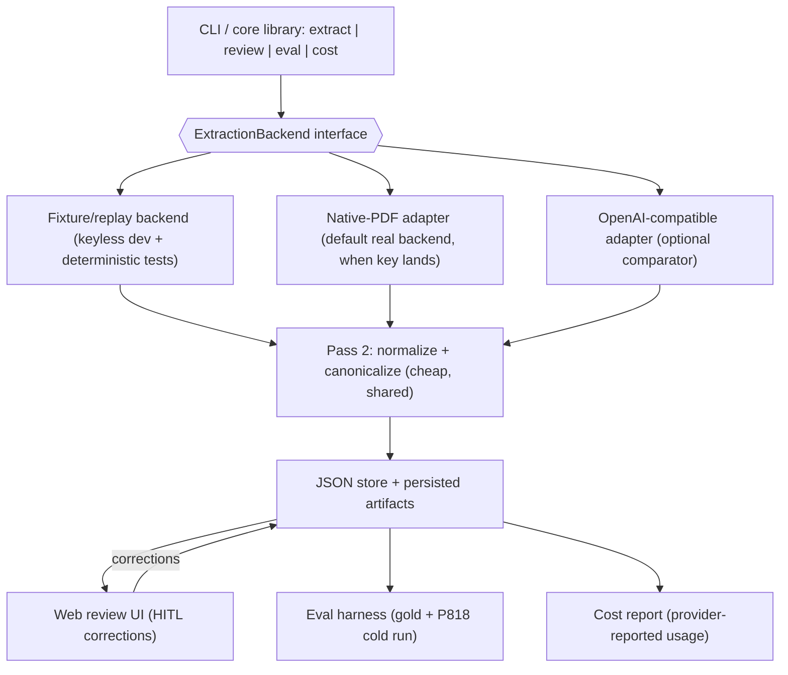

# Datasheet Extraction - Build Plan (v3)

Working plan for the Raven backend assignment. 24h budget, balanced across the four graded
deliverables: extraction quality, reliability/cost, HITL feedback loop, communication.

v3 trims the implementation surface to what is credible in 24h: JSON-only store, fixture backend for
keyless dev, one real provider adapter + one optional comparator, no SQLite, no separate
classification pass, no local OCR. Provider-neutral throughout - the model is a config behind the
interface, chosen by eval when a key lands.

---

## 1. The problem in one line

Extract structured, *cited* fields from heterogeneous process datasheets (PDF) into a *generic,
queryable* schema, with a human-in-the-loop correction interface - and prove it generalizes to
layouts we did not tune on.

### What the inputs actually demand (from inspecting the 4 PDFs)
- **Heterogeneous templates**: P300228 & P600173 share a bilingual FR/EN form; P718/P818 are a
  totally different row-numbered template. -> single generic extractor, never per-template parsers.
- **No reliable text layer**: P600173 page 1 has 0 extractable characters (flattened scan). ->
  vision is the only common denominator.
- **Bilingual labels** (FR/EN), **mixed units** (metric kg/cm2 g, m3/h vs imperial GPM, psig, degF, hp).
- **Footnotes** qualify values ("2.7 (4)" -> "estimated, confirm with vendor").
- **Checkboxes** encode choices (CONTINUOUS vs DISCONTINUOUS, single/double volute).
- **Multi-case tables** (P718 off-spec table): same field recurs per operating condition.
- **Redacted fields** (black boxes over client/project).

---

## 2. MVP gate (the must-finish core)

The submission is complete only when all of these are true. Lock this before any stretch work.

- [ ] CLI extracts each PDF to a structured JSON document.
- [ ] Schema carries citations + confidence + verbatim provenance per field.
- [ ] FastAPI review UI lists fields (confidence-sorted) and can confirm/correct them.
- [ ] Corrections persist to disk (reviewed output separate from raw extraction).
- [ ] Small eval report (accuracy/coverage on a gold subset + P818 cold run).
- [ ] Cost-per-doc measured and reported.
- [ ] Write-up + recorded demo done.

A clean core (extraction + citations + review + eval + cost) beats an unfinished multi-backend
system. The assignment rewards judgment over breadth.

---

## 3. Core principles
1. **Schema-open extraction.** Pass 1 harvests generic document primitives (key-value pairs,
   checkbox groups, footnotes, multi-case tables, title block) - never a fixed pump field list. This
   is the defense against unseen documents.
2. **Verbatim first, canonical second.** Capture what the doc literally says (+page+snippet) before
   mapping to a canonical key. Bilingual/unit problems become mapping problems, not perception ones.
3. **Perception (vision) separated from reasoning (text).** Pass 1 = swappable vision backend;
   Pass 2 = shared cheap normalization.
4. **Graceful degradation.** Unknown field -> kept as free-form key with full provenance. Low
   confidence -> routed to HITL, never silently wrong.
5. **Prove generalization.** P818 is reserved as a cold-eval document: not used for prompt tuning,
   schema tuning, or gold-label design. (One text-layer sanity check across all four files is the
   only time it has been touched.)

---

## 4. Architecture



One product, pluggable backend, CLI-native. All backends feed the same schema, same Pass 2, same
eval. Provenance is **model-emitted page + verbatim snippet** in the structured output (not
API-native citations - see SS5/SS6), verified by our grounding check - so it works identically across
providers.

---

## 5. Output schema (the graded centerpiece)

Flat EAV / field-list model. Generic enough for any equipment type; queryable via a controlled
canonical-key vocabulary; provenance on every field.

```jsonc
{
  "doc_id": "pds-P300228",
  "doc_type": "centrifugal_pump_datasheet",   // emitted by Pass 1 (no separate classify call)
  "language": ["fr", "en"],
  "source_pages": 2,
  "fields": [
    {
      "id": "pds-P300228:p1:bhp_rated:0",      // deterministic: doc:page:slug:index
      "type": "scalar",                         // scalar | checkbox | table_cell | note | title_block | free_text
      "canonical_key": "power.shaft.rated",     // controlled vocab; null if unmapped
      "label_verbatim": "P. ABS / BHP RATED",
      "value_raw": "2.7",
      "value_normalized": 2.7,                   // null if not numeric
      "unit": "kW",                              // kept EXACTLY as written
      "unit_si": "kW",                           // separate best-effort normalization; null if no clean conversion
      "qualifiers": ["estimated", "to be confirmed by pump vendor"],  // resolved from note (4)
      "case": "design",                          // operating-condition tag for multi-case tables
      "citation": {
        "page": 1,
        "snippet": "P. ABS ... 2.7 (4) kW",      // model-emitted; our provenance
        "source_backend": "fixture",
        "text_layer_match": true                 // grounding result; false/null if no text layer
      },
      "confidence": 0.71,                        // single score
      "mapping_uncertain": false,                // canonical_key mapping was low-signal
      "review_status": "unreviewed",             // unreviewed | confirmed | corrected
      "original_value_raw": null,                // set on correction (powers feedback->exemplar)
      "reviewed_at": null
    },
    {
      "id": "pds-P300228:p1:client:0",
      "type": "title_block",
      "canonical_key": "client.name",
      "label_verbatim": "CLIENT / CUSTOMER",
      "value_raw": "[REDACTED]",                 // explicit sentinel - never hallucinate a name
      "value_normalized": null,
      "unit": null,
      "qualifiers": ["redacted"],
      "case": null,
      "citation": { "page": 1, "snippet": "CLIENT / CUSTOMER [black box]", "source_backend": "fixture", "text_layer_match": false },
      "confidence": 1.0,
      "review_status": "unreviewed",
      "original_value_raw": null,
      "reviewed_at": null
    }
  ],
  "notes": [ { "marker": "(4)", "text": "ESTIMATED SHAFT POWER. TO BE CONFIRMED BY PUMP VENDOR...", "page": 1 } ]
}
```

**Tension resolved explicitly (call out in write-up):** controlled `canonical_key` -> queryability;
free-form keys for anything unmapped -> flexibility; data is never dropped.

**Schema decisions:**
- **Stable `id`** (deterministic) - load-bearing for HITL edits + eval matching.
- **`type`** tag - cheap; powers UI rendering and eval slicing.
- **One `confidence`** + a `mapping_uncertain` flag (no two graded numbers a human won't calibrate).
- **Provenance = model-emitted `page` + `snippet`**, verified by grounding (`text_layer_match`).
  NOT API-native citations: incompatible with structured outputs, unsupported on images, and
  provider-specific. `bbox` deferred (LLMs are poor at coordinates).
- **`original_value_raw` + `reviewed_at`** on correction - free, and required to build
  correction -> exemplar pairs. (reviewer/reason = optional; single-user take-home.)
- **Units**: keep `unit` exactly as written; `unit_si` separate, null when no clean conversion;
  treat gauge vs absolute (kg/cm2 g vs kg/cm2 a) as distinct - do not silently merge.
- **Redaction**: `value_raw: "[REDACTED]"`, `qualifiers: ["redacted"]` - never a hallucinated name.

---

## 6. Extraction pipeline (two passes)

- **Pass 1 - verbatim harvest (vision, capable model):** extract every label-value pair as written +
  units + checkbox selections + footnote markers + page + verbatim snippet; extract the remarks/notes
  table separately; emit multi-case rows tagged by `case`; **also emit `doc_type` + `language`**
  (no separate classification call). Maximize recall + provenance. Output constrained by the
  adapter's native JSON-schema / JSON mode where supported, validated by us regardless.
  - **Input granularity (backend-agnostic):** native-PDF providers get the PDF directly; image-only
    providers get per-page rasterized images (PyMuPDF). Provenance is always model-emitted
    page+snippet in the structured output, verified by grounding. Always rasterize anyway for the
    grounding check and for image-only backends.
- **Pass 2 - normalize + canonicalize (cheap model, text-only):** map `label_verbatim` ->
  `canonical_key`; normalize value+unit; resolve footnote markers -> `qualifiers`; set `confidence`
  and `mapping_uncertain`. Iterable, tiny cost.
- **Merge:** combine pages, dedupe title-block repeats.

**Grounding / anti-hallucination:** keep deterministic PyMuPDF page text as an artifact; where it
exists, string-match each `value_raw` against page text and set `text_layer_match`. Absent -> lower
confidence / flag (won't fire on the P600173 scan - recorded as grounding-unavailable).

---

## 7. Reliability (rubric: "reliability and cost / failure modes")

- **Persist intermediate artifacts** under `outputs/artifacts/<doc_id>/`: rendered page images, raw
  PyMuPDF text, Pass-1 raw output, Pass-2 normalized output, final merged JSON. Makes failures
  inspectable; makes a better demo.
- **Validation + repair:** validate Pass-1/Pass-2 output against the Pydantic schema; on
  invalid/incomplete JSON, one repair attempt (re-prompt with the error); if it still fails, stop and
  write the raw artifact rather than emit garbage.
- **Failure modes tracked:** hallucinated values, dropped fields, wrong checkbox reads, footnote
  misattribution, gauge-vs-absolute unit confusion, redacted-field garbage, digit misreads,
  case/column misalignment in multi-case tables.

---

## 8. Backends (provider-neutral, key-independent)

No API keys yet (any provider "might" become available). The system is built without a key; the real
provider is chosen by eval when a key lands. One default + one optional comparator.

| Adapter | Purpose | v1 |
|---|---|---|
| **Fixture / replay** | Records + replays responses. Builds the whole system keyless; gives **deterministic end-to-end tests + UI demo**. Does NOT prove extraction quality (that needs a real key). | Built first |
| **Native-PDF adapter** | Default real backend (e.g. Claude or Gemini): PDF passed directly, strong document understanding. | Wired when a key lands |
| **OpenAI-compatible adapter** | Optional comparator. One adapter reaches Kimi / GPT by swapping `base_url`+key (image-based -> rasterize). | Post-MVP only |

Model choice is a config behind the interface, decided by the A/B eval on these 4 docs - not on
paper. The README permits any stack ("Tools/Stack: Anything") and grades cost-per-doc, so a
cheap-but-accurate model is a legitimate win. Indicative rates only (full table in WRITEUP): frontier
Claude/GPT are dollars-range per 1M output tokens; Kimi K2.6 is the cheapest candidate. Spend design
budget on schema/eval/HITL/reliability, not model selection.

**Critical-path risk - keys.** Without a key we build and demo on fixtures but cannot produce real
accuracy/cost numbers (both graded). Mitigation: we need only one cheap key for a handful of real
extractions to populate the eval + cost table. Resolve "get one key" early; everything else proceeds
keyless in parallel. Model IDs and SDK calls are verified during adapter wiring.

---

## 9. HITL feedback loop

- Lightweight FastAPI + minimal frontend (ergonomics only, no fancy UI per the brief).
- **Field-first**: all fields sorted by ascending confidence, with filters by document / page /
  canonical_key. Confidence routing connects extraction -> review.
- **Citation beside the field**: page + snippet inline (and rendered page image when available) so the
  reviewer does not hunt through the PDF. Editable value/unit/canonical_key; Confirm / Correct set
  `review_status`, capture `original_value_raw` + `reviewed_at`.
- **Corrections are reusable**: a human mapping `P. ABS / BHP RATED` -> `power.shaft.rated` persists
  as a canonical-vocabulary mapping. This is the clearest "feedback improves the pipeline" story.
- **Export after review**: `outputs/raw/*.json` vs `outputs/reviewed/*.json`.
- **Demonstrate the loop with a bounded before/after (the HITL highlight):** show a measurable eval
  delta from feeding a correction back as a **canonical-vocab mapping / Pass-2 few-shot exemplar** -
  *not* by rerunning full vision extraction (keeps it cheap, deterministic, key-light). Write-up notes
  that feeding corrections into Pass-1 few-shot is the natural extension.

---

## 10. Eval harness

- **Gold set:** hand-label a small, query-anchored subset (~15-25 fields/doc) on **P300228,
  P600173, P718 only**. Anchor on the README example-query fields: impeller material, pumped fluid,
  nominal/max flow, motor efficiency, corrosion/erosion. Hold this line; no coverage creep.
- **Partial-correctness metrics** per field: label found, value correct, unit correct, citation
  valid, canonical_key correct. Aggregate to accuracy + coverage (fraction of gold fields correctly
  extracted).
- **Hallucination metric:** on text-layer pages, count ungroundable `value_raw`; on scanned pages,
  mark grounding unavailable.
- **P818 cold run:** no P818 in any tuning; run cold; report separately as the generalization result.
  Keep runway - P818 may be a third template that exposes a schema gap.
- Once a key exists: run the gold set through the default and (post-MVP) the one comparator -> table.

---

## 11. Cost

Each adapter records **provider-reported usage** from the response; when usage is unavailable,
estimate from the provider's documented pricing. Output (~3-4k structured tokens/doc) dominates;
caching the schema/instruction prefix keeps input cheap. Levers reported in write-up: prompt caching,
model tier, batch APIs for eval runs. Full per-provider pricing table lives in WRITEUP.md.

---

## 12. Tech stack & layout (Python, JSON store)

```
datasheet/
  __init__.py
  schema.py            # pydantic models (id, type, citation, provenance)
  render.py            # PyMuPDF: PDF->PNG, text-layer extraction (grounding + artifact)
  backends/
    base.py            # ExtractionBackend interface
    fixture.py         # record/replay - keyless dev + deterministic tests
    native_pdf.py      # default real adapter (Claude or Gemini), wired when key lands
    openai_compat.py   # optional comparator (Kimi / GPT via base_url), post-MVP
  pipeline.py          # Pass 1/2 orchestration, merge, grounding, validate+repair
  store.py             # JSON persistence; raw vs reviewed; canonical-vocab mappings
  cost.py              # provider-reported usage accounting
  artifacts.py         # persist images / raw text / pass-1 / pass-2 / final
  eval/
    gold/              # hand labels (P300228, P600173, P718) - NOT P818
    run_eval.py        # partial-correctness metrics, P818 cold run
  web/
    app.py             # FastAPI review UI (field-first, filters, citation inline)
cli.py                 # extract | review | eval | cost
outputs/
  raw/  reviewed/  artifacts/
WRITEUP.md             # skeleton in Phase 1, filled as we go; holds full pricing table
README.md              # install / extract / review / eval / where outputs land
```
Adapter-native JSON-schema / JSON mode where supported; we validate the output regardless. No SQLite
(JSON files are enough for 4 docs and easier to demo/diff).

---

## 13. 24h sequence (risk-ordered, MVP-gated)

**Gate principle:** fixture backend + Pass 1/2 + eval + HITL + write-up + demo are the submission.
The real provider populates real numbers when a key lands. The comparator is post-MVP only.

1. **0-2h** Schema + CLI skeleton + render/text-layer + **fixture/replay backend** (whole pipeline
   runs keyless). Create `WRITEUP.md` skeleton. (In parallel, chase one API key.)
2. **2-6h** Pass 1 verbatim harvest prompt + JSON contract; notes + checkboxes + multi-case +
   redaction sentinel + doc_type/language; validate+repair; tune on P300228/P600173/P718.
3. **6-9h** Pass 2 normalize/canonicalize + grounding + merge + artifact persistence.
4. **9-12h** JSON store (raw vs reviewed, vocab mappings) + FastAPI review UI (confidence-sorted,
   filters, citation inline, confirm/correct).
5. **12-15h** Gold labels + eval harness (partial-correctness, coverage, hallucination); cost
   accounting wiring.
6. **15-18h** P818 cold run (keep runway for a schema gap); bounded feedback->Pass-2 measurable
   delta; sample `outputs/` JSON committed.
7. **18-21h** Write-up + recorded demo + README commands.  <-- submission complete here. HARD GATE.
8. **21-24h** Only if gate green: wire the OpenAI-compatible comparator -> same eval -> accuracy/cost
   comparison table.

> Key dependency: steps 5-7 run on the fixture backend until a key exists. The moment one cheap key
> lands, re-run eval + cost against the real provider to populate real numbers - the single most
> important thing to unblock.

---

## 14. Deliverables
- Recorded demo of extraction + HITL review.
- Write-up (`WRITEUP.md`): architecture, schema, extraction strategy, HITL loop, evaluation, cost
  (full pricing table), failure modes, future work; trade-offs (generic-vs-queryable,
  vision-vs-classical, provider comparison).
- Sample output JSON (`outputs/raw/pds-P300228.json`) for fast evaluation.
- README with install / extract / review / eval commands and where outputs land.
- Private fork shared with evaluator.

---

## 15. Non-goals / future work (explicitly out of scope for v1)
Auth, deployment, fancy UI, model fine-tuning, per-template parsers, pixel-perfect bounding boxes,
**SQLite**, **separate Pass 0 classification**, **local OCR/VLM backend** (PaddleOCR / Qwen2-VL),
**split extraction/normalization confidence**, **canonical-vocab routing by doc_type**,
**API-native citations**.
